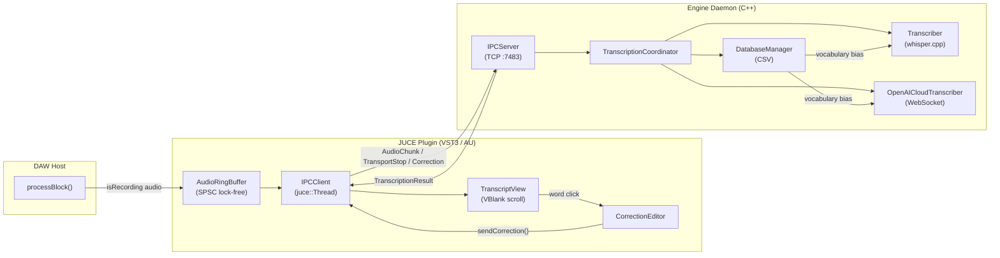

# Punch to Pen (punch2pen) — Real-time speech-to-text for Digital Audio Workstations

punch2pen transcribes vocals inside a DAW in real time, displaying a scrolling karaoke-style transcript that stays in sync with the playback cursor. Users can click any word in the transcript to correct mis-transcriptions, and those corrections feed back into the model to improve future accuracy.

## Architecture

Two cooperating processes communicate over **local TCP on port 7483** using a custom binary protocol defined in `shared/Protocol.h`.



**Plugin side:** `processBlock()` captures audio only when the DAW transport reports `isRecording == true`. Samples are written into a lock-free `AudioRingBuffer` (SPSC, in `plugin/Source/RingBuffer.h`). An `IPCClient` thread drains the ring buffer and streams `AudioChunk` messages to the engine.

**Engine side:** `TranscriptionCoordinator` polls the `IPCServer` for audio, transport-stop events, and correction messages in a 1 ms loop. Audio is forwarded to whichever `TranscriberInterface` backend is active. Results flow back through the IPC connection and appear in the plugin's `TranscriptView`.

## Key Capabilities

| Feature | Implementation |
|---|---|
| **VBlank-synced scrolling transcript** | `TranscriptView` uses `juce::VBlankAttachment` with spring-eased interpolation (`currentScrollY += delta * 0.15f`) |
| **Polymorphic transcription backend** | Local whisper.cpp (`Transcriber`) or cloud OpenAI Realtime WebSocket API (`OpenAICloudTranscriber`), switchable via CLI `--cloud --api-key=` |
| **Correction feedback loop** | User corrections stored in CSV at `~/.punch2pen/corrections.csv`; vocabulary extracted to bias future transcriptions via `initial_prompt` |
| **Record-state gating** | Audio only captured when DAW transport reports `isRecording == true` |
| **Karaoke-style word highlighting** | `updatePlaybackPosition()` sets per-word alpha states (1.0 active, 0.6 upcoming, 0.4 past) |
| **Click-to-correct UI** | `TranscriptView` word hit detection triggers `CorrectionEditor` popup; corrections are submitted via IPC to the engine |
| **Plugin state persistence** | `transcriptionMode` and `bpm` saved via ValueTree XML serialization in `getStateInformation` / `setStateInformation` |

## Prerequisites

- **CMake 3.20** or higher
- **C++20** compliant compiler
- **macOS** with Accelerate framework (used by whisper.cpp)
- ~150 MB disk space for the whisper GGML model

Dependencies fetched automatically by CMake via `FetchContent`:
- [whisper.cpp](https://github.com/ggerganov/whisper.cpp) v1.7.4
- [nlohmann/json](https://github.com/nlohmann/json) v3.11.3
- [IXWebSocket](https://github.com/machinezone/IXWebSocket) v11.4.5
- [JUCE](https://github.com/juce-framework/JUCE) (only when building the plugin)

## Build

```bash
git clone --recursive https://github.com/keeganmoody33/punch2pen.git
cd punch2pen

# Engine only
cmake -B build -S .
cmake --build build --target punch2penEngine -j4

# With plugin
cmake -B build -S . -DPUNCH2PEN_BUILD_PLUGIN=ON
cmake --build build -j4
```

## Running

```bash
# Download whisper model
./scripts/download_model.sh base

# Local offline mode (default)
./build/bin/punch2penEngine

# Cloud streaming mode
./build/bin/punch2penEngine --cloud --api-key=YOUR_KEY
```

The `--api-key=` flag can be omitted if the `OPENAI_API_KEY` environment variable is set (see `engine/src/main.cpp` lines 60-64).

## Repository Structure

| Path | Description |
|---|---|
| `engine/` | Background transcription daemon (whisper.cpp, OpenAI Realtime, IPC server, coordinator loop) |
| `engine/tests/` | Unit tests for coordinator, database manager, profile manager, protocol serialization, OpenAI JSON |
| `plugin/` | JUCE DAW plugin — audio capture, IPC client, transcript UI, correction editor |
| `plugin/Source/` | C++ plugin sources (`PluginProcessor`, `PluginEditor`, `TranscriptView`, `CorrectionEditor`, `IPCClient`, `RingBuffer`) |
| `shared/` | Protocol definitions shared between plugin and engine (`Protocol.h`) |
| `scripts/` | Model download and verification helpers |
| `installer/` | macOS distribution packaging (`installer/macos/build_pkg.sh`) |

## Roadmap

The following items are **planned but not yet implemented**:

- **ProfileManager persistence** — stubs exist in `engine/src/ProfileManager.h` with `loadProfile()` / `saveProfile()` but no file I/O is wired
- **Expanded test coverage** — current tests cover coordinator, database, profile, protocol serialization, and OpenAI JSON parsing; integration and plugin-side tests are planned
- **CI/CD pipeline** — no automated build/test pipeline exists yet

## Documentation

See the [project wiki](https://github.com/keeganmoody33/punch2pen/wiki) for detailed technical documentation covering architecture deep-dives, protocol specifics, and component design.
