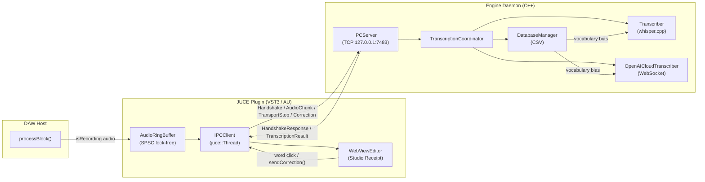

# Punch to Pen (punch2pen) — Real-time speech-to-text for Digital Audio Workstations

punch2pen transcribes vocals inside a DAW in real time. During playback the UI is a **Living Transcript**: it highlights the word under the playhead and treats the active line as a title. Users can click any word to correct a mis-hear; those corrections feed back into the model.

## Architecture

Two cooperating processes communicate over **local TCP on port 7483** using a custom binary protocol defined in `shared/Protocol.h`.


```mermaid
flowchart LR
    subgraph DAW["DAW Host"]
        PB["processBlock()"]
    end

    subgraph Plugin["JUCE Plugin (VST3 / AU)"]
        RB["AudioRingBuffer<br/>(SPSC lock-free)"]
        IPC_C["IPCClient<br/>(juce::Thread)"]
        WV["WebViewEditor<br/>(Studio Receipt)"]
    end

    subgraph Engine["Engine Daemon (C++)"]
        IPC_S["IPCServer<br/>(TCP 127.0.0.1:7483)"]
        TC["TranscriptionCoordinator"]
        T["Transcriber<br/>(whisper.cpp)"]
        OAI["OpenAICloudTranscriber<br/>(WebSocket)"]
        DB["DatabaseManager<br/>(CSV)"]
    end

    PB -- "isRecording audio" --> RB
    RB --> IPC_C
    IPC_C -- "Handshake / AudioChunk / TransportStop / Correction" --> IPC_S
    IPC_S --> TC
    TC --> T
    TC --> OAI
    TC --> DB
    IPC_S -- "HandshakeResponse / TranscriptionResult" --> IPC_C
    IPC_C --> WV
    WV -- "word click / sendCorrection()" --> IPC_C
    DB -- "vocabulary bias" --> T
    DB -- "vocabulary bias" --> OAI
```

**Plugin side:** `processBlock()` captures audio only when the DAW transport reports `isRecording == true`. Samples are written into a lock-free `AudioRingBuffer` (SPSC, in `plugin/Source/RingBuffer.h`). An `IPCClient` thread completes a protocol handshake, drains the ring buffer, and streams `AudioChunk` messages to the engine. The editor is a WebView shell (`plugin/Source/ui/public/index.html`).

**Engine side:** `TranscriptionCoordinator` polls the `IPCServer` for audio, transport-stop events, and correction messages in a 1 ms loop. Audio is forwarded to whichever `TranscriberInterface` backend is active. Results flow back through the IPC connection and appear in the plugin WebView. Local whisper refuses to start if the model file is missing. The engine exits if it cannot bind `127.0.0.1:7483`.

## Key Capabilities

| Feature | Implementation |
|---|---|
| **Studio Receipt WebView** | One HTML blob in `juce::WebBrowserComponent` (`plugin/Source/ui/public/index.html`); default editor size 400×600, resizable |
| **Polymorphic transcription backend** | Local whisper.cpp (`Transcriber`) or cloud OpenAI Realtime WebSocket API (`OpenAICloudTranscriber`), switchable via CLI `--cloud --api-key=` |
| **Correction feedback loop** | User corrections stored in CSV at `~/.punch2pen/corrections.csv`; vocabulary extracted to bias future transcriptions via `initial_prompt` |
| **Record-state gating** | Audio only captured when DAW transport reports `isRecording == true` |
| **Living Transcript** | WebView highlights the word under the playhead using engine `startTime`/`endTime` |
| **Click-to-correct UI** | Word click opens the Direction C correction overlay; corrections are submitted via IPC to the engine |
| **Plugin state persistence** | `transcriptionMode` and `bpm` saved via ValueTree XML serialization in `getStateInformation` / `setStateInformation` |
| **Fail-loud local engine** | Missing `~/.punch2pen/models/ggml-base.bin` or a failed `127.0.0.1:7483` bind exits the engine with status 1 |
| **macOS installer** | Unsigned pkg via `installer/macos/build_pkg.sh` (AU + VST3 + engine). Bundle ID `com.doctaaa.punch2pen`. Codes remain **Dcta / P2pn / aufx**. |

## Prerequisites

- **CMake 3.22** or higher
- **C++20** compliant compiler
- **macOS** with Accelerate framework (used by whisper.cpp)
- ~150 MB disk space for the whisper GGML model

Dependencies fetched automatically by CMake via `FetchContent`:
- [whisper.cpp](https://github.com/ggerganov/whisper.cpp) v1.7.4
- [nlohmann/json](https://github.com/nlohmann/json) v3.11.3
- [IXWebSocket](https://github.com/machinezone/IXWebSocket) v11.4.5
- [JUCE](https://github.com/juce-framework/JUCE) (only when building the plugin)

## Build

```bash
git clone --recursive https://github.com/keeganmoody33/punch2pen.git
cd punch2pen

# Engine only
cmake -B build -S .
cmake --build build --target punch2penEngine -j4

# With plugin
cmake -B build -S . -DPUNCH2PEN_BUILD_PLUGIN=ON
cmake --build build -j4
```

## Running

```bash
# Download whisper model
./scripts/download_model.sh base

# Local offline mode (default)
./build/bin/punch2penEngine

# Cloud streaming mode
./build/bin/punch2penEngine --cloud --api-key=YOUR_KEY
```

The `--api-key=` flag can be omitted if the `OPENAI_API_KEY` environment variable is set. Do not bake a vendor key into the installer.

Plugin auto-launch looks for `PUNCH2PEN_ENGINE`, then a nested `Contents/Helpers/punch2penEngine.app` inside the AU/VST3 bundle, then `/Applications/Punch2Pen/punch2penEngine.app`. It starts that app with Launch Services (`open -g`) so Logic's AU sandbox does not inherit onto the engine. A bare `punch2penEngine` at `/Applications/Punch2Pen/punch2penEngine` is the posix_spawn fallback. Leftover `~/punch2pen/bin/punch2penEngine` from old builds is ignored (those binaries still have a CI/build-machine rpath and die in dyld). Launch is retried every few seconds until TCP `127.0.0.1:7483` handshakes.

The engine is built with whisper/ggml/ixwebsocket statically linked when possible. Any remaining dylibs ship next to the binary. `LC_RPATH` is `@executable_path` / `@loader_path`, not the GitHub Actions runner or a `/tmp` build dir.

## macOS installer

```bash
./installer/macos/build_pkg.sh
```

Writes an unsigned `dist/Punch2Pen_Installer.pkg`. Requires CMake plugin builds (`-DPUNCH2PEN_BUILD_PLUGIN=ON`). AU validation after install:

```bash
auval -strict -v aufx P2pn Dcta
```

The plugin must instantiate with the engine down. Auto-launch is a background helper, not part of AU initialize.

### GitHub Release (unsigned Mac pkg)

`auval` is **skipped** on GitHub-hosted macos runners: they have no signed AU host session, and this unsigned WebView AU (`AU_SANDBOX_SAFE FALSE`) is not a reliable CI gate. Run `auval -strict -v aufx P2pn Dcta` on a Mac after install. Identity stays **Dcta / P2pn / aufx**, bundle ID `com.doctaaa.punch2pen`.

Cut a downloadable installer:

1. Tag the commit and push (this is the path that works before the workflow is on `main`):

   ```bash
   git tag v1.0.0
   git push origin v1.0.0
   ```

2. After this workflow is on `main`, you can also use **Actions → macOS Release → Run workflow** and enter tag `v1.0.0`.

Wait for the **macOS Release** workflow. Download `Punch2Pen-1.0.0-macOS-unsigned.pkg` from [Releases](https://github.com/keeganmoody33/punch2pen/releases). The package is unsigned; Gatekeeper will warn. Place `ggml-base.bin` at `~/.punch2pen/models/ggml-base.bin`. The public download page is [punch2pen.com](https://punch2pen.com) (`site/` in this repo).

## Public site

Static landing page + Cloudflare Worker in `site/`. Copy: punch-in problem, Mac pkg from GitHub Release, free/lite vs paid/pro with **no prices**. PostHog events are wired (`download_click`, `interest_would_pay`, `waitlist_submit`); set `POSTHOG_KEY` as a Wrangler secret to actually send them.

```bash
cd site
npm install
npx wrangler deploy
```

## Repository Structure

## Repository Structure

| Path | Description |
|---|---|
| `engine/` | Background transcription daemon (whisper.cpp, OpenAI Realtime, IPC server, coordinator loop) |
| `engine/tests/` | Unit tests for coordinator, database manager, profile manager, protocol serialization, OpenAI JSON |
| `plugin/` | JUCE DAW plugin — audio capture, IPC client, Studio Receipt WebView |
| `plugin/Source/` | C++ plugin sources (`PluginProcessor`, `PluginEditor`, `WebViewEditor`, `IPCClient`, `RingBuffer`) |
| `plugin/tests/` | Unit tests for RingBuffer, IPCClient, and PluginProcessor state persistence |
| `shared/` | Protocol definitions shared between plugin and engine (`Protocol.h`) |
| `scripts/` | Model download, engine smoke, vocal golden-file, DAW readiness helpers |
| `fixtures/vocals/` | Drop-in dry WAV + expected words (audio gitignored; see README there) |
| `site/` | punch2pen.com landing page (Cloudflare Worker + static assets) |
| `installer/` | macOS distribution packaging (`installer/macos/build_pkg.sh`) |

## DAW Integration Readiness

Before opening Logic Pro, REAPER, Ableton Live, or another DAW, run the end-to-end readiness checker:

```bash
./scripts/test_daw_integration.sh --download-model
```

For a local install into the current macOS user account, run:

```bash
./scripts/test_daw_integration.sh --download-model --install-plugin --setup-engine-link
```

The script checks macOS prerequisites, CMake/compiler availability, DAW detection, model files, build artifacts, engine startup on `127.0.0.1:7483`, IPC correction submission, plugin bundles, code signing status, and the exact manual DAW checklist to follow next.

## Testing

Green unit CI is not a Logic punch. Layers:

| Layer | Command | Needs |
|---|---|---|
| Engine unit tests | `databaseManagerTest` … `transcriptTimingTest` (CI `engine-tests`) | CMake |
| Plugin unit tests | `ringBufferTest`, `ipcClientTest`, `pluginProcessorStateTest`, `pluginProcessorCaptureTest` (CI `plugin-tests`) | macOS + JUCE |
| Engine smoke (no Logic) | `./scripts/engine_smoke.sh` (CI `engine-smoke`) | whisper `ggml-base.bin`; isolated `PUNCH2PEN_HOME` |
| Vocal golden file | `python3 scripts/verify_engine.py vocals` | Your dry WAV in `fixtures/vocals/` — **SKIP** if missing |
| AU identity | `auval -strict -v aufx P2pn Dcta` | Mac after AU install. **Not** GitHub-hosted runners |
| Logic punch | Insert **punch2pen**, arm, record, watch the Living Transcript | M-series MacBook Pro only |

Do not check in commercial songs. See `fixtures/vocals/README.md`. `scripts/verify_correction.py` now exits 1 on a dead engine. `scripts/verify_transcription.py` is a sine-wave **protocol** probe, not STT quality.

## Roadmap

The following items are **planned but not yet implemented**:

- End-to-end automated host validation inside a real DAW session. The readiness script prepares the machine and opens the DAW, but recording/monitoring in Logic Pro or another host still requires manual confirmation. Engine smoke and a skip-if-no-vocals golden file live in `scripts/engine_smoke.sh`.

**Recently completed:**

- ~~ProfileManager persistence~~ — per-user JSON profile loading/saving is implemented and wired into the engine startup/shutdown path.
- ~~Expanded test coverage~~ — plugin-side tests now exist for `AudioRingBuffer`, `IPCClient`, and `PluginProcessor` state round-trip (see `plugin/tests/`)
- ~~CI/CD pipeline~~ — GitHub Actions CI runs engine tests and plugin tests as parallel jobs

## Documentation

See the [project wiki](https://github.com/keeganmoody33/punch2pen/wiki) for detailed technical documentation covering architecture deep-dives, protocol specifics, and component design.
