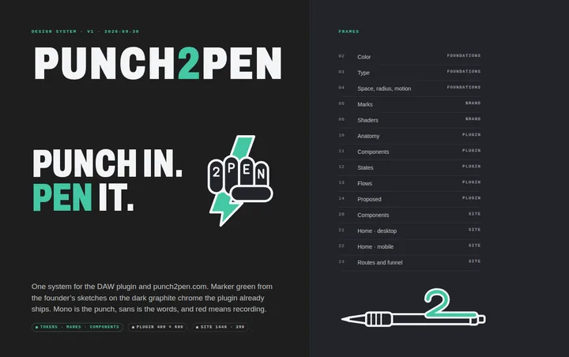

# Punch2Pen design system

One system for the DAW plugin (AU/VST3 Living Transcript) and punch2pen.com. Built as Paper-ready HTML so it can go straight onto a Paper Desktop canvas. See [PAPER.md](PAPER.md).



## Direction (decided 2026-09-30)

**Marker green from the founder's sketches, on the dark graphite chrome the plugin ships today.**

This replaces two conflicting directions in the repo:

| Where | Before | Now |
|---|---|---|
| Plugin UI (`#21`, latest) | "Open": graphite, teal `#7AD4C0` | Graphite kept. Accent is marker green `#43C7A3` |
| Site + `plugin/Source/ui/HANDOFF.md` (`#32`) | "Booth paper": warm black, vermillion `#E4452F`, serif lyrics | Superseded. HANDOFF's token table is now stale |

The green is sampled from the index-card sketch (bolt fill `#31755B` in the photo). White-balancing it against the paper gives the marker, `#2A6F5D` at hue 164. The same hue is lifted to `#43C7A3` so it clears contrast on graphite. Every text pair passes WCAG AA; the one deliberate exception is past lyric lines at 0.38 opacity (frame 02 has the table).

The rules that fall out of it:

- **Red is REC.** Nothing else in product UI is red.
- **Green is live:** accent, primary action, PLAY, LIVE, corrected, synced.
- **Amber is waiting:** WAIT, the engine banner, pending sync.
- **Ink is the plate:** the word under the playhead is an ink plate, never a color fill.
- **Mono is the punch** (clock, labels), **sans is the words**, **Archivo is the poster** (site and brand only; the DAW loads no webfonts).
- **The Pad** is the index card from the sketch: red header rule, blue lines, marker ink. It's where words land when they leave the booth.

## What's here

```
design/
├── PAPER.md                 how to put this on the Paper canvas
├── tokens/
│   ├── tokens.json          source of truth (W3C design-token format)
│   ├── build.mjs            → tokens.css + contrast report
│   └── tokens.css           generated
├── brand/
│   ├── build_marks.py       all marks from one geometry file
│   └── *.svg                fist, pen, two, bolt, wordmark (-booth / -pad), favicon
├── components/
│   ├── plugin.css           Living Transcript parts (p-*)
│   ├── site.css             punch2pen.com parts (s-*)
│   └── pad.css              the index-card surface
├── frames/                  one HTML file per Paper artboard
├── renders/                 WebP of every frame (for review and Paper comparison)
└── tools/render.mjs         re-measure frames and re-render
```

| Frame | Artboard | Status |
|---|---|---|
| 01 | Cover | |
| 02 | Color | |
| 03 | Type | |
| 04 | Space, radius, motion | |
| 05 | Marks | New |
| 10 | Plugin anatomy | Shipped behavior, proposed parts marked |
| 11 | Plugin components | Shipped behavior, proposed parts marked |
| 12 | Plugin states (6) | Shipped behavior |
| 13 | Plugin flows: correct, sign in, click to jump | Correct and sign in shipped; jump proposed |
| 14 | Plugin proposed: Flow Grid, Dictionary, Pen it + lyric sheet | Proposed |
| 20 | Site components | Restyle of shipped site |
| 21 | Site home, 1440 | Restyle, real copy |
| 22 | Site home, 390 | Restyle, real copy |
| 23 | Site routes and funnel | Real routes and PostHog events |

## Regenerate

```bash
node design/tokens/build.mjs            # tokens.css + contrast report
pip install fonttools brotli            # once, for the wordmark
python3 design/brand/build_marks.py     # every SVG in design/brand/
node design/tools/render.mjs            # needs playwright; then convert PNG → renders/*.webp
```

## Mapping to shipped code

The shipped editor (`plugin/Source/ui/public/index.html`) binds to IDs. The semantic token names (`--bg-deep`, `--bg-pane`, `--bg-chrome`, `--bg-raised`, `--ink-*`, `--accent`, `--rec`, `--wait`, `--play`, `--past`, `--upcoming`, `--lyric-size`, `--title-size`, `--mono`, `--sans`) are the same names the plugin and `site/public/site.css` already use, so adopting this is mostly a value swap.

| Design class | Shipped element |
|---|---|
| `.p-header` · `.p-wordmark` · `.p-pill` · `.p-badge` | `#header-bar` · `#app-title` · `#profile-pill` · `#status-badge` |
| `.p-transport` · `.p-sync` | `#position-display` · `#sync-indicator` |
| `.p-banner` | `#connection-banner` |
| `.p-pane` · `.p-line` · `.p-word` | `#transcript-container` · `.lyric-line` · `.lyric-word` |
| `.p-rtl` | `#return-to-live` |
| `.p-sheet` | `#correction-overlay` |
| `.p-pop` · `.p-row` | `#profile-popover` · `.profile-row` / `.seat-row` |
| `.p-status` · `.p-logo` | `#status-bar` · `#logo-mark` |

## Changes from what ships

Restyle only. The C++ ↔ JS contract, IDs, states, and `Dcta / P2pn / aufx` stay.

- Accent teal → marker green; `--ink-3` 0.48 → 0.54 so chrome labels clear 4.5:1.
- Wordmark is an outlined SVG; the outlined **2** fills the `#logo-mark` placeholder (HANDOFF follow-up 1).
- The struck-out word in the correction sheet is grey, not red.
- The free-tier nudge in the status bar wraps to two lines instead of truncating at 400 px.
- Mobile site: the download button becomes "Copy download link", since the pkg is Mac-only.

Proposed features, drawn but not built:

- **Click a word to jump the playhead** (frame 13). A standard AU/VST3 insert can read the host clock but can't move it. ARA 2's playback controller (`requestSetPlaybackPosition`) can. Without ARA 2 the click shows the exact bar, beat, and time with a copy button. Correcting moves to double-click or Return.
- **Syllable fill and the Flow Grid** (frames 11, 14). They need syllable onsets from the engine; today the engine returns word start and end.
- **Dictionary panel** with word, adlib, and phrase entries (frame 14).
- **Pen it**: copy, .txt, PDF lyric sheet on the Pad, share link for signed-in profiles (frame 14).

## Open threads

1. **Paper import.** You run [PAPER.md](PAPER.md) on your Mac.
2. **ARA 2 or not.** Click-to-jump depends on it. This is an engineering call before it's a design call.
3. **Syllable timing.** Check what the transcription path can return before building the grid.
4. **Implement the restyle.** Swap tokens in `plugin/Source/ui/public/index.html` and `site/public/site.css`, add the SVGs, update `HANDOFF.md`'s token table.
5. **Activation is unmeasured.** The site sends six PostHog events. The plugin, engine, and profile API send none, so install, first punch, first correction, and sign-in are invisible (frame 23). Any instrumentation needs an opt-in the free tier can keep honest.
6. **Marks are v1.** They are faithful vector readings of the sketches. Iterate them in Paper, then carry the changes back into `build_marks.py`.

Example data in the frames (the profile "Nova", "Room 4", take numbers, dictionary counts) is made up and labelled as such on each board. Lyrics are the original demo verse from the plugin's preview mode.
